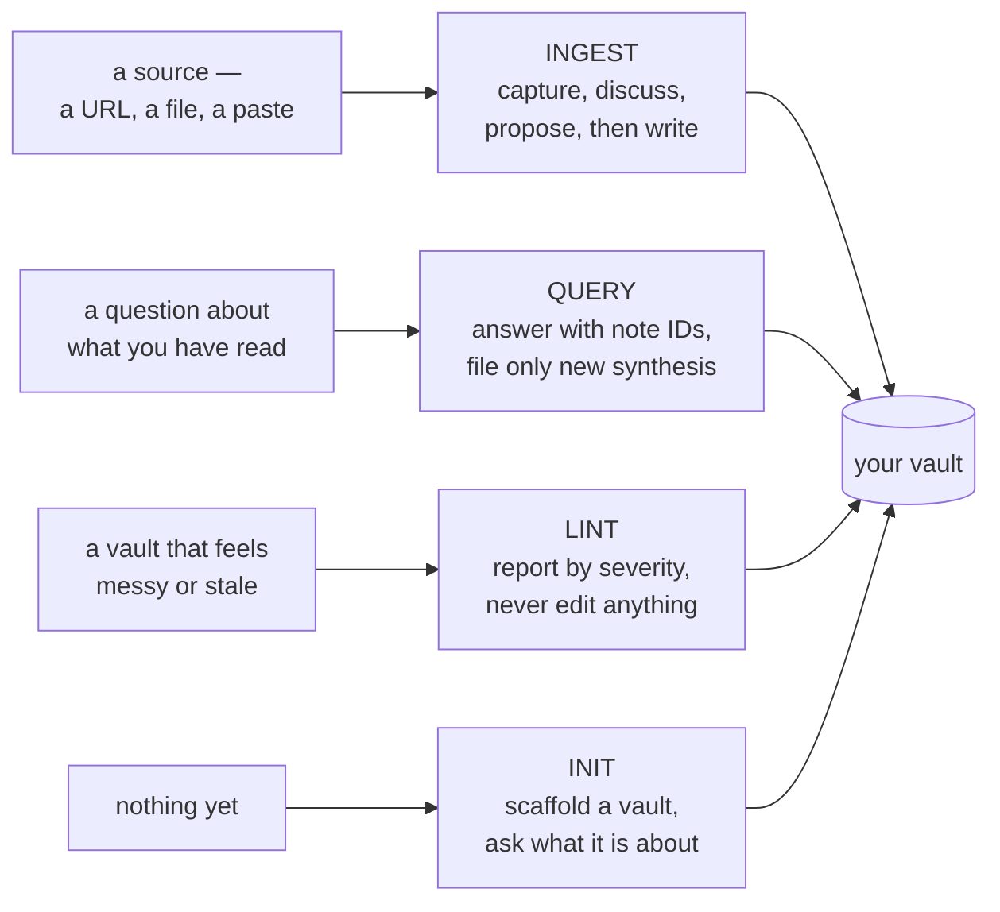
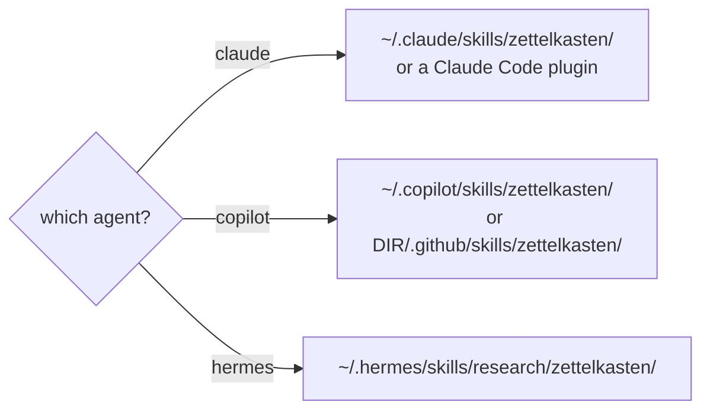
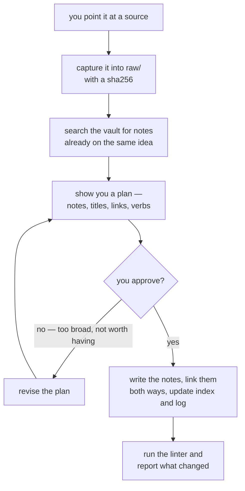

# Getting started

This skill turns your agent into the maintainer of a **Zettelkasten**: a vault of atomic notes
where each note holds one idea, notes are densely linked with typed verbs, and every claim traces
back to a source.

You do not write the notes. You hand over sources, approve a plan, and ask questions. The agent
compiles, links, and keeps the structure honest — and a bundled linter checks its work.

**The one rule that matters:** an ingest *proposes before it writes*. You see exactly which notes
it intends to create before any file appears.

---

## What you can ask for

Four operations, and which one you want is decided by what you are holding.



You do not have to name the operation. Saying *"ingest this"*, *"what do my notes say about
spacing"*, *"lint the vault"* or *"start me a Zettelkasten"* is enough; the skill recognises all
four. Everything below is one of these four, in the order you will meet them.

---

## Install

The skill is one directory — `SKILL.md` plus `references/`, `templates/` and `scripts/` —
placed wherever your agent looks for skills.

**On Claude Code**, install it as a plugin:

```bash
claude plugin marketplace add Dmytro-Kopylov-personal/zettelkasten-skill
claude plugin install zettelkasten@zettelkasten-skill
```

In a session those are `/plugin marketplace add` and `/plugin install`. This is the tidy path: it
keeps the skill in Claude Code's own plugin store, where updating and removing it are one command.
Skip to [Your first vault](#your-first-vault) once it is in.

**On Claude Code, Copilot or Hermes**, clone the repo and let the installer place it:

```bash
./install.sh --platform claude --dry-run --force   # counts what would change, writing nothing
./install.sh --platform claude --force     # then for real — ~/.claude/skills/zettelkasten/
./install.sh --platform copilot --force    # ~/.copilot/skills/zettelkasten/
./install.sh --platform hermes --force     # ~/.hermes/skills/research/zettelkasten/
```

It lands in one directory, wherever that agent looks for skills:



**Start with `--dry-run`.** It names the destination, counts what would be written, backed up and
left alone, and writes nothing at all — not one file, not even its bookkeeping manifest. On a first
install it needs `--force` alongside it, which there only permits *looking* at a skills directory
that does not exist yet. Drop `--dry-run` to install for real; keep `--force` for that first run.

**`--force` is required the first time**, because the platform's skills directory usually does not
exist until the agent has run at least once, and the installer refuses to invent one — a missing
root may mean the platform is not installed at all. With `--force` it creates that one directory
and nothing else. It never overwrites a file the installer did not write; the remedy there is for
you to move the file, not to re-run with a flag.

Leave `--platform` off and it detects what you have. Re-running is a no-op, and a file it *did*
write is backed up to `.bak.<timestamp>` before being replaced.

**Copilot users:** do not use `copilot skill add <url>`. It fetches a single `SKILL.md` and nothing
else, which installs a skill whose `references/` and `scripts/` are missing. Point it at the cloned
directory instead, or use `install.sh`.

### Or skip the install entirely

The linter is a single stdlib-only file with no dependencies. It runs against any vault straight
from a clone, which makes it usable in CI with nothing else installed:

```bash
python3 -I skill/scripts/zettel_lint.py /path/to/vault
```

---

## Your first vault

### 1. Start one

> **You:** Start a Zettelkasten for me — its subject is how claims get verified.

The agent creates the vault in a folder of its own, named `zettelkasten/`, rather than taking over
the directory you are standing in:

```
zettelkasten/
├── SCHEMA.md          the vault's own conventions — domain, tags, thresholds
├── log.md             one line per operation, oldest first
├── raw/               sources, captured and never edited again
│   ├── articles/
│   ├── papers/
│   └── notes/
├── permanent/         the notes
├── structure/         index.md, concept-table.md, overview.md
└── inbox/             quick captures awaiting triage
```

`SCHEMA.md` is the important one. It is the vault's constitution, and it **overrides the skill's
defaults** — if your schema says two link verbs, the agent uses two.

### 2. Ingest a source

> **You:** Ingest `~/Downloads/spacing-and-the-forgetting-curve.md`

The whole contract is the gate in the middle. Nothing reaches `permanent/` until you have seen
what it intends to write and said yes:



It reads the source, searches the vault for anything already covering the same ground, then shows
you a plan. A real one, from a run of this skill, lightly trimmed for length:

> **Reconnaissance** — `permanent/` is empty, so there are no existing notes to duplicate. The
> vault's schema sets the domain — *how claims get verified* — and declares an **empty tag
> taxonomy**, so I will assign no tags rather than invent them.
>
> **Plan**
>
> 1. **Capture** `source.md` → `raw/articles/spacing-and-the-forgetting-curve.md`, body reproduced
>    byte-for-byte, with `ingested: 2026-09-26`. The `sha256` will be left **empty** with a comment
>    giving the fix command: a fabricated digest is worse than a missing one — it would trigger a
>    false drift alarm, whereas an absent one produces an accurate finding. `raw/` is immutable
>    after this capture.
> 2. **Four permanent notes** (atomic, claim-titled, `status: seed`, `confidence: medium` — single
>    source, so never `high`):
>
>    | ID | Title |
>    |---|---|
>    | `202609261200` | Spacing works because retrieval after partial forgetting is effortful |
>    | `202609261201` | How easy study feels is a poor guide to whether it worked |
>    | `202609261202` | Testing changes the knowledge it measures |
>    | `202609261203` | A retrieval attempt is worth most when it follows real forgetting |
>
> 3. **Eight links**, verbs drawn only from the vault's list. **No `supports` links**: these four
>    notes come from a single source, and `supports` claims independent evidence — `extends` and
>    `applies` state these relations honestly.
> 4. **Register** — four lines in `structure/index.md`; one dated ingest entry plus one verification
>    entry in `log.md`.

Three things worth noticing. It searched before proposing. It refused to invent a digest rather
than fabricate one. And it declined to use a link verb that would have been dishonest — linking
notes derived from *one* source with `supports` would claim they corroborate each other.

You approve, and only then does anything get written. If the plan is wrong — the notes too broad,
one of them not worth having — you say so and it revises.

### 3. Ask it something

> **You:** What do my notes say about why spacing works?

It answers with note IDs so you can check the reasoning yourself, reads the notes in full rather
than grepping, and **files a new note only if the answer is genuine synthesis** — something the
existing notes do not already say.

### 4. Check its work

> **You:** Lint the vault

```
error: 1
  ZK014  raw/articles/spacing-and-the-forgetting-curve.md:1  the raw file records no sha256
        subject: sha256
        action:  run `zettel_lint.py hash <file>` and record the digest

4 notes, 1 raw source, 8 links, orphan rate 0%
NOT RUN: ZK016 (not applicable: SCHEMA.md declares no tag taxonomy)
NOT RUN: ZK024 (not applicable: no note cites 3 or more sources)
NOT RUN: ZK027 (not applicable: no note uses the 'contradicts' verb)
NOT RUN: ZK029 (not applicable: only 8 links; the check needs 20)
NOT RUN: ZK031 (not applicable: the inbox is empty)
```

The single `error` is the point. Nothing had computed the digest, so rather than passing the file
the linter says so — and the five `NOT RUN` lines name the checks this vault is too small to
exercise, instead of letting their silence read as a pass. That is the design: a check that cannot
run is reported as not-run, never as a pass.

The linter **never edits anything**. It reports; the agent proposes a fix; you approve.

---

## What a note looks like

A real note, produced by an ingest of the source above. Verbatim apart from line-wrapping, which
is reflowed to fit this page:

```markdown
---
id: "202609261202"
title: Testing changes the knowledge it measures
type: permanent
status: seed
created: 2026-09-26
updated: 2026-09-26
sources:
  - raw/articles/spacing-and-the-forgetting-curve.md
confidence: medium
links:
  - target: 202609261200-spacing-works-through-effortful-reconstruction
    verb: extends
  - target: 202609261201-fluency-during-study-is-a-poor-guide-to-learning
    verb: extends
---

Retrieval practice is a separate mechanism from spacing, with a similar profile, and its effect
is not confined to measurement: the act of retrieving changes what will be known later.
^[raw/articles/spacing-and-the-forgetting-curve.md]

A test is therefore not a neutral reading of a learner's state. It reports where the memory
stands when it is taken, and it also alters where the memory will stand afterwards; the source
treats the second as a mechanism in its own right rather than as a side effect of measuring.
^[raw/articles/spacing-and-the-forgetting-curve.md]

## Links

- **extends** [[202609261200-spacing-works-through-effortful-reconstruction]] — generalizes its
  mechanism: reconstruction is a property of retrieval, not of a review schedule
- **extends** [[202609261201-fluency-during-study-is-a-poor-guide-to-learning]] — adds a second
  way a learner's own assessment misleads: the probe changes what it probes
```

Four things carry the weight:

- **`id`** is `YYYYMMDDHHMM`, and the filename is `id-slug.md`. Stable identity means a link does
  not break when you retitle a note.
- **`sources:`** names what the claim came from, and **`^[...]` markers** in the body say which
  paragraph came from where. This is what makes a claim checkable later.
- **`links:` with a `verb`** — not a bare "see also". The six verbs are `extends`, `supports`,
  `contradicts`, `source`, `applies`, `supersedes`, and each one makes a different claim.
- **One idea.** If you find yourself writing "and", it is probably two notes.

## Why atomicity matters

A wiki has a page per *thing*. A Zettelkasten has a note per *idea*. That difference is the whole
point: ideas can be recombined, and things cannot. The value is not in any single note — it is in
the links between them, which only mean something if each end is one idea you can disagree with.

A folder of beautifully written unlinked notes is a pile, and the linter will say so.

## When the agent has no shell

Some environments ship an agent with no way to run a command. The skill degrades rather than
breaking: `references/tool-free-fallback.md` gives a manual procedure for every check, and requires
the agent to **name the checks it could not perform** rather than implying a clean vault. The
`NOT RUN` lines above are the same obligation where the linter *does* run: coverage is stated, so
silence is never mistaken for a pass.

## Going deeper

| | |
|---|---|
| `skill/references/note-format.md` | the note contract, field by field |
| `skill/references/schema-reference.md` | `SCHEMA.md`, the six verbs, thresholds, the Page Threshold |
| `skill/references/lint-checks.md` | all 32 checks: predicate, remediation, and a manual-scan line |
| `skill/references/tool-free-fallback.md` | what to do with no shell |
| `docs/architecture.md` | how it is shaped, and where the three platforms pull apart — diagrams |
| `docs/design.md` | why it is built this way, including what went wrong on the way |
| `docs/results.md` | what has actually been measured, and what has not |

## A note on trust

Every claim in this repo is backed by something checkable, and the README names what was *not*
verified — Copilot's VS Code extension, the Copilot cloud agent — rather than leaving you to find
out. The measurements carry the same markers, including where the skill's own evaluation turned out
to be weaker than it looked (`docs/design.md`, finding V8; the run trees are in `docs/results.md`).
