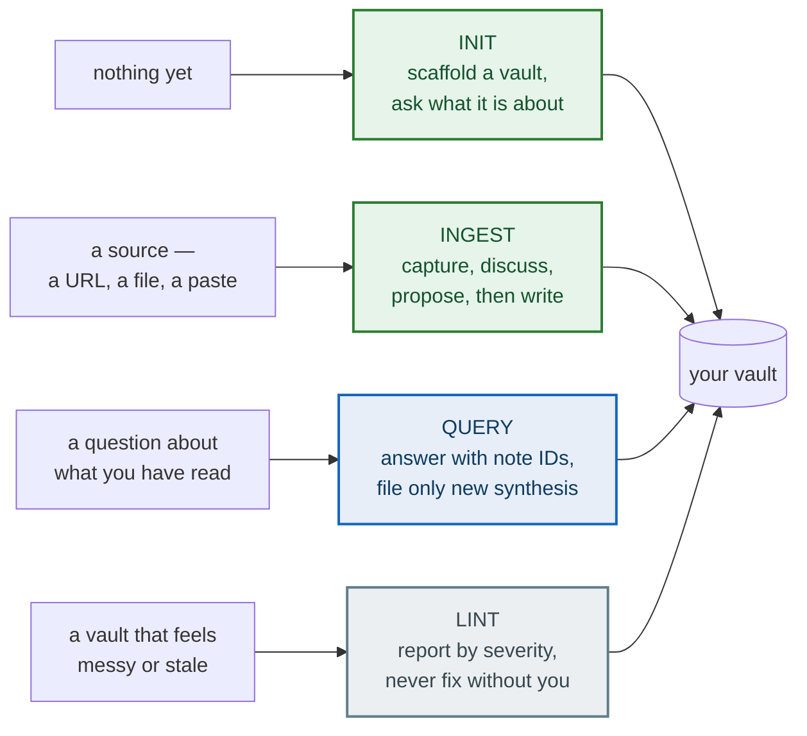
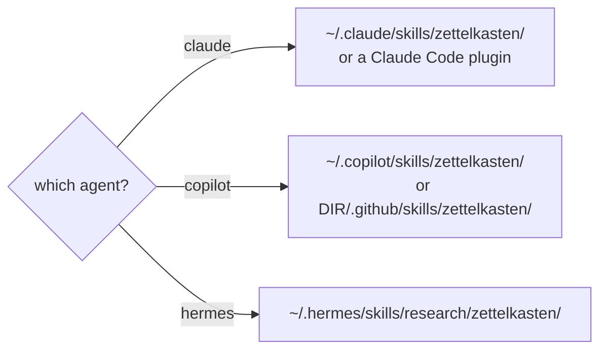
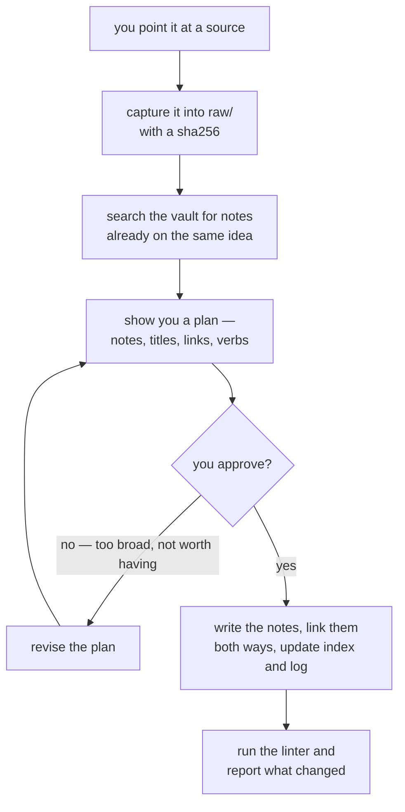
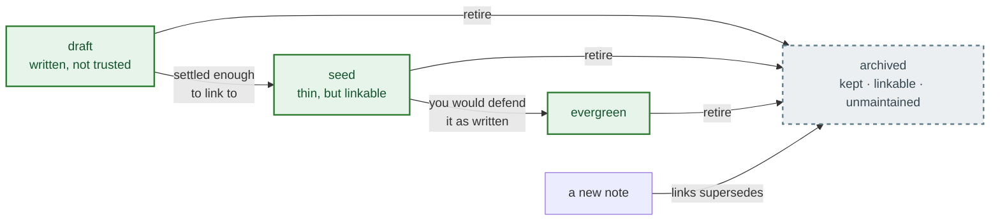

# zettelkasten-skill

<p align="center">
  
</p>

A portable agent skill that turns an agent into a **Zettelkasten maintainer**: raw sources
compile into atomic, densely-linked, provenance-carrying permanent notes.

One capability, three platforms — Hermes, Claude Code, and GitHub Copilot — assembled from a
shared body plus a thin per-platform seam, so the same skill behaves the same way wherever it
runs.

The difference from a wiki is atomicity: a wiki has a page per *thing*, a Zettelkasten has a
note per *idea*, and the value lives in the links between them. A note carries typed link verbs
— `extends`, `supports`, `contradicts`, `source`, `applies`, `supersedes` — because "see also"
claims nothing, and a folder of beautifully written unlinked notes is a pile.

**Nothing reaches `permanent/` before you approve a plan, and no bundled script writes anything
at all.** That is the short version. The full contract is under [Your files](#your-files), once
you have seen it work.

---

## What you can ask for

Four operations, and which one you want is decided by what you are holding.



The colours say what each operation does to the vault, not how important it is: green writes —
`init` creates it, `ingest` proposes and then writes — blue reads and files only genuine new
synthesis, and grey changes nothing on its own. `lint` reports, and its fixes are proposals that
wait for your approval like any other write — which is the property the rest of this page leans on.
The labels say the same thing the colours do, so the diagram still reads in greyscale.

You do not have to name the operation. Saying *"ingest this"*, *"what do my notes say about
spacing"*, *"lint the vault"* or *"start me a Zettelkasten"* is enough; the skill recognises all
four. [Your first vault](#your-first-vault) below is one of each.

---

## Install

The skill is one directory — `SKILL.md` plus `references/`, `templates/` and `scripts/` —
placed wherever your agent looks for skills.

**On Claude Code**, install it as a plugin:

```bash
claude plugin marketplace add Dmytro-Kopylov-personal/zettelkasten-skill
claude plugin install zettelkasten@zettelkasten-skill
```

In a session those are `/plugin marketplace add` and `/plugin install`. This is the tidy path: it
keeps the skill in Claude Code's own plugin store, where updating and removing it are one command.
Skip to [Your first vault](#your-first-vault) once it is in.

**On Claude Code, Copilot or Hermes**, clone the repo and let the installer place it:

```bash
git clone https://github.com/Dmytro-Kopylov-personal/zettelkasten-skill.git
cd zettelkasten-skill

./install.sh --platform claude --dry-run --force   # counts what would change, writing nothing
./install.sh --platform claude --force     # then for real — ~/.claude/skills/zettelkasten/
./install.sh --platform copilot --force    # ~/.copilot/skills/zettelkasten/
./install.sh --platform hermes --force     # ~/.hermes/skills/research/zettelkasten/
```

It lands in one directory, wherever that agent looks for skills:



**Start with `--dry-run`.** It names the destination, counts what would be written, backed up and
left alone, and writes nothing at all — not one file, not even its bookkeeping manifest. On a first
install it needs `--force` alongside it, which there only permits *looking* at a skills directory
that does not exist yet. Drop `--dry-run` to install for real; keep `--force` for that first run.

**`--force` is required the first time**, because the platform's skills directory usually does not
exist until the agent has run at least once, and the installer refuses to invent one — a missing
root may mean the platform is not installed at all. With `--force` it creates that one directory
and nothing else. It never overwrites a file the installer did not write; the remedy there is for
you to move the file, not to re-run with a flag. A file it *did* write is backed up to
`.bak.<timestamp>` before being replaced, and re-running is a no-op.

Leave `--platform` off and it detects what you have. Exit codes: 0 ok · 1 render failure or a
missing `python3`/sha256 tool · 2 usage · 3 platform not detected · 4 unmanaged file.

Copilot has two locations, and they are different scopes:

```bash
./install.sh --platform copilot --force                    # personal: ~/.copilot/skills/
./install.sh --platform copilot --project-root /path/repo  # project: /path/repo/.github/skills/
```

Install **one** personal copy per machine. Copilot's own help text also lists a project's
`.claude/skills/` among the sources it reads, so a repo already carrying the Claude render might
not need a second copy — untested here, and `copilot skill list` answers it before you install
twice.

**Copilot users:** do not use `copilot skill add <url>`. It fetches a single `SKILL.md` and nothing
else, which installs a skill whose `references/` and `scripts/` are missing. Point it at the cloned
directory instead, or use `install.sh`.

### Or skip the install entirely

The linter is a single stdlib-only file with no dependencies. It runs against any vault straight
from a clone, which makes it usable in CI with nothing else installed:

```bash
python3 -I skill/scripts/zettel_lint.py /path/to/vault
```

No virtualenv, no `pip install`, no third-party imports. The `-I` is not decoration: it ignores
`PYTHONPATH` and the user site directory, so a script that had grown a dependency would fail here
rather than on a machine that happens to have it.

### Pinning the vault

A machine can hold more than one vault, so the skill resolves which one to work in by a fixed order.
It is in the shared body, so it is the same on all three platforms:

1. A path you gave in the request.
2. `ZETTELKASTEN_VAULT_PATH`.
3. A walk upward from the working directory for a directory holding all three of `SCHEMA.md`,
   `permanent/` and `log.md`.
4. Asking you. It never guesses, and never writes against a vault it has not confirmed.

Two vaults under one parent is enough to make step 3 ambiguous: the search finds both, and nothing
in it says which one you meant. Setting the variable removes the search entirely.

```sh
export ZETTELKASTEN_VAULT_PATH="$HOME/notes/zettelkasten"
```

Put that in `~/.zshenv` rather than `~/.zshrc`. `.zshrc` is read only by *interactive* shells, so an
export there is invisible to anything a script, a task runner, a desktop application or another
agent's shell tool spawns — which is most of the callers this variable exists to pin down.
`.zshenv` is read by every zsh, interactive or not.

Two limits worth knowing. A shell that reads no zsh startup file at all — a bash-only environment,
or a desktop application whose environment comes from the session rather than a shell — still misses
the export, and falls through to the walk-up and then to asking. That direction is safe, but it is
not a pin. And the variable has to be *read*: an agent with no way to run a command cannot see it
either, so it too falls through to step 3. For that case, `references/tool-free-fallback.md` covers
running without a shell at all.

---

## Your first vault

Four worked examples, in the order you will meet them. Each is marked with where it came from:
three are real output, and the one that could not be is labelled rather than passed off.

### 1. Start one — *real, run while writing this*

> **You:** Start a Zettelkasten for me — its subject is how claims get verified.

The agent creates the vault in a folder of its own, named `zettelkasten/`, rather than taking over
the directory you are standing in:

```
zettelkasten/
├── SCHEMA.md          the vault's own conventions — domain, tags, thresholds
├── log.md             one line per operation, oldest first
├── raw/               sources, captured and never edited again
│   ├── articles/
│   ├── papers/
│   └── notes/
├── permanent/         the notes
├── structure/         index.md, concept-table.md, overview.md
└── inbox/             quick captures awaiting triage
```

`SCHEMA.md` is the important one. It is the vault's constitution, and it **overrides the skill's
defaults** — if your schema says two link verbs, the agent uses two.

Then it lints the empty vault, which is the first place the design shows:

```
0 notes, 0 raw sources, 0 links, orphan rate 0%
NOT RUN: ZK003..ZK030 (22 checks; not applicable: the vault has no permanent notes)
NOT RUN: ZK014, ZK019, ZK026 (not applicable: the vault has no raw sources)
NOT RUN: ZK029 (not applicable: only 0 links; the check needs 20)
NOT RUN: ZK031 (not applicable: the inbox is empty)
no findings
```

`no findings`, exit 0 — and twenty-seven checks named as **not run**. That distinction is the whole
design: a check that cannot run is reported as not-run, never as a pass, so a small vault cannot
read as a clean one by accident.

### 2. Ingest a source — *real, from a recorded run*

> **You:** Ingest `~/Downloads/spacing-and-the-forgetting-curve.md`

The whole contract is the gate in the middle. Nothing reaches `permanent/` until you have seen what
it intends to write and said yes:



It reads the source, searches the vault for anything already covering the same ground, then shows
you a plan. This one is real output from a run, lightly trimmed for length:

> **Reconnaissance** — `permanent/` is empty, so there are no existing notes to duplicate. The
> vault's schema sets the domain — *how claims get verified* — and declares an **empty tag
> taxonomy**, so I will assign no tags rather than invent them.
>
> **Plan**
>
> 1. **Capture** `source.md` → `raw/articles/spacing-and-the-forgetting-curve.md`, body reproduced
>    byte-for-byte, with `ingested: 2026-09-26`. The `sha256` will be left **empty** with a comment
>    giving the fix command: a fabricated digest is worse than a missing one — it would trigger a
>    false drift alarm, whereas an absent one produces an accurate finding. `raw/` is immutable
>    after this capture.
> 2. **Four permanent notes** (atomic, claim-titled, `status: seed`, `confidence: medium` — single
>    source, so never `high`):
>
>    | ID | Title |
>    |---|---|
>    | `202609261200` | Spacing works because retrieval after partial forgetting is effortful |
>    | `202609261201` | How easy study feels is a poor guide to whether it worked |
>    | `202609261202` | Testing changes the knowledge it measures |
>    | `202609261203` | A retrieval attempt is worth most when it follows real forgetting |
>
> 3. **Eight links**, verbs drawn only from the vault's list. **No `supports` links**: these four
>    notes come from a single source, and `supports` claims independent evidence — `extends` and
>    `applies` state these relations honestly.
> 4. **Register** — four lines in `structure/index.md`; one dated ingest entry plus one verification
>    entry in `log.md`.

Three things worth noticing. It searched before proposing. It refused to invent a digest rather
than fabricate one. And it declined to use a link verb that would have been dishonest — linking
notes derived from *one* source with `supports` would claim they corroborate each other.

You approve, and only then does anything get written. If the plan is wrong — the notes too broad,
one of them not worth having — you say so and it revises.

### 3. Ask it something — *illustrative, not a recorded run*

> **You:** What do my notes say about why spacing works?

> **Agent:** Three notes bear on it.
>
> - `202609261200` — *Spacing works because retrieval after partial forgetting is effortful*:
>   the benefit comes from reconstructing an answer that has partly decayed, not from the review
>   schedule itself.
> - `202609261201` — *How easy study feels is a poor guide to whether it worked*: rereading feels
>   more productive than it is, which is why learners under-use spacing.
> - `202609261203` — *A retrieval attempt is worth most when it follows real forgetting*: the
>   effortful-reconstruction account predicts that a review timed before forgetting helps less.
>
> Together they say the mechanism is retrieval difficulty, and that it is self-concealing: the
> conditions that feel least like learning are the ones that work. `202609261203` states this as a
> prediction rather than a finding — the source does not test review timing directly.

**This one is written, not recorded** — the repo has no stored query run, and the alternative was
to pass off an invented answer as real. What it illustrates is the contract: the agent answers with
note IDs so you can check the reasoning yourself, reads the notes in full rather than grepping, and
**files a new note only if the answer is genuine synthesis** — something the existing notes do not
already say. Here it is not, so nothing was filed.

### 4. Check its work — *real, from a recorded run*

> **You:** Lint the vault

```
error: 1
  ZK014  raw/articles/spacing-and-the-forgetting-curve.md:1  the raw file records no sha256
        subject: sha256
        action:  run `zettel_lint.py hash <file>` and record the digest

4 notes, 1 raw source, 8 links, orphan rate 0%
NOT RUN: ZK016 (not applicable: SCHEMA.md declares no tag taxonomy)
NOT RUN: ZK024 (not applicable: no note cites 3 or more sources)
NOT RUN: ZK027 (not applicable: no note uses the 'contradicts' verb)
NOT RUN: ZK029 (not applicable: only 8 links; the check needs 20)
NOT RUN: ZK031 (not applicable: the inbox is empty)
```

The single `error` is the point. Nothing had computed the digest, so rather than passing the file
the linter says so — and the five `NOT RUN` lines name the checks this vault is too small to
exercise, instead of letting their silence read as a pass.

The linter **never edits anything**. It reports; the agent proposes a fix; you approve. The remedy
for the finding above is `zettel_lint.py hash <file>`, which prints a digest for you to record —
it does not write it into the file.

---

## What a note looks like

A real note, produced by an ingest of the source above. Verbatim apart from line-wrapping, which
is reflowed to fit this page:

```markdown
---
id: "202609261202"
title: Testing changes the knowledge it measures
type: permanent
status: seed
created: 2026-09-26
updated: 2026-09-26
sources:
  - raw/articles/spacing-and-the-forgetting-curve.md
confidence: medium
links:
  - target: 202609261200-spacing-works-through-effortful-reconstruction
    verb: extends
  - target: 202609261201-fluency-during-study-is-a-poor-guide-to-learning
    verb: extends
---

Retrieval practice is a separate mechanism from spacing, with a similar profile, and its effect
is not confined to measurement: the act of retrieving changes what will be known later.
^[raw/articles/spacing-and-the-forgetting-curve.md]

A test is therefore not a neutral reading of a learner's state. It reports where the memory
stands when it is taken, and it also alters where the memory will stand afterwards; the source
treats the second as a mechanism in its own right rather than as a side effect of measuring.
^[raw/articles/spacing-and-the-forgetting-curve.md]

## Links

- **extends** [[202609261200-spacing-works-through-effortful-reconstruction]] — generalizes its
  mechanism: reconstruction is a property of retrieval, not of a review schedule
- **extends** [[202609261201-fluency-during-study-is-a-poor-guide-to-learning]] — adds a second
  way a learner's own assessment misleads: the probe changes what it probes
```

Four things carry the weight:

- **`id`** is `YYYYMMDDHHMM`, and the filename is `id-slug.md`. Stable identity means a link does
  not break when you retitle a note.
- **`sources:`** names what the claim came from, and **`^[...]` markers** in the body say which
  paragraph came from where. This is what makes a claim checkable later.
- **`links:` with a `verb`** — not a bare "see also". The six verbs are listed above, and each one
  makes a different claim.
- **One idea.** If you find yourself writing "and", it is probably two notes.

A folder of beautifully written unlinked notes is a pile, and the linter will say so.

---

## Retiring a note

There is no delete operation and no `remove` verb. The four operations are `init`, `ingest`, `query`
and `lint`, and what this skill offers instead of removal is **retirement**, which keeps the record.
That is the vault's premise rather than a missing feature: a vault that deletes what it no longer
believes cannot show that it changed its mind.



Green is a working state and grey is the one you leave on purpose; the successor note stays
uncoloured because it is an actor here, not a state. The colours only echo what each box already
says, so the diagram still reads in greyscale.

Every note is in one of those four states, and `status` is a required field, so there is no fifth.
The first three are working states. The moves between them are promotions, and nothing promotes a
note for you: `ZK017` is the only nudge in the system, a warning that a `draft` or `seed` has gone
untouched for `lint_stale_draft_days` — 90 by default — and its wording is the choice it is offering
you, *promote it, split it, or archive it*. `archived` is the one state you leave on purpose.

**Archiving is the ordinary retirement.** Set a note's `status:` to `archived` and it stays where it
is, stays linkable, and stops asking to be maintained — the staleness prompt (`ZK017`) watches only
`draft` and `seed`. Nothing else moves. In a vault of thirty notes, archiving the most heavily linked
note in it left every count identical and raised no finding: exit 0 before and after.

**Superseding is archiving with a successor.** Write the note that replaces it, link the new one to
the old with `supersedes`, and archive the old one. The old note keeps its place in the graph and in
the history; what changes is that nothing points at it as current. This is the same instinct as the
`contradicts` rule in [Your files](#your-files) — the record of what was believed is the thing that
makes the vault worth keeping.

**Deleting is possible, and loud.** Nothing forbids removing the file. The vault notices anyway:
deleting that same note produced nine findings — eight `ZK008` dangling links, one for each note
pointing at it, plus a `ZK012` for the index entry still naming it. Each finding names the file to
edit, so the work saved by deleting is work done again afterwards.

The exception is the two places where deletion *is* the intended move: a `raw/` capture or an
`inbox/` file you have decided against. Both say the same thing — compile a note from it, or delete
it and say why in the log. A queue that only grows is not a queue.

So: **archive to retire, supersede to replace, delete only what was never a note.**

---

## Your files

This skill writes into a vault you own, so what it will and will not touch matters more than
anything above.

**Nothing reaches `permanent/` before you approve a plan.** Ingest captures the source, searches
the vault for notes already covering the same ground, then shows you what it intends to create —
titles, one-line theses, and the links between them — and waits. If the plan is wrong, you say so
and it revises.

**No bundled script writes anything at all.** There is no `--fix`, deliberately: the mechanically
fixable findings are exactly where a wrong edit corrupts a vault quietly. The linter reports, the
agent proposes, you approve. This is not a policy statement — a test hashes the whole fixture tree
before and after a full lint run and fails if a single byte moved, and a second test reads every
shipped script looking for a write call and fails if it finds one. Both carry a control in the
opposite direction, so neither a proof that had stopped noticing writes nor a scan that had stopped
recognising them could pass quietly.

**`raw/` is captured once and never edited again.** A source records a `sha256` at capture and the
linter compares the file against its own digest. When they differ it *reports* drift; it never
repairs it in place. A correction belongs in a note, and a source that changed belongs in a
re-ingest.

**A contradiction never overwrites.** Conflicting evidence gets its own note with a `contradicts`
link and dates on both sides, because editing the old claim into agreement destroys the thing the
vault is for.

**The installer backs up what it replaces and refuses what it did not write.** A file it wrote is
copied to `.bak.<utc>` before being replaced. A file it did not write halts the install with exit
4 and a list of the paths; the remedy is a person moving them and there is no flag that overrides
it.

**The vault root is the boundary.** `init` gives a vault its own folder rather than adopting the
directory it runs in, because a vault sharing a directory with other work puts all of it inside the
blast radius — and ingest, which updates existing notes, would then edit files it never created.

One honest limit: that boundary is a rule the body states and a grader checks, not a sandbox. The
agent runs with your permissions, as agents do. If you want a wall rather than a checked contract,
point it at a directory whose only contents are the vault.

---

## Obsidian

A vault is plain Markdown — `.md` files, YAML frontmatter, `[[wikilinks]]` — so **open the folder as
an Obsidian vault and it works.** Obsidian's out-of-the-box settings are the ones this skill writes:
wikilinks rather than Markdown links, and the shortest link format, which is exactly
`[[202609251200-slug]]`. Notes may be filed into subdirectories of `permanent/`, and a link resolves
by name alone, so it finds its note wherever it sits. Callouts, `%%comments%%`, dataview fences,
`^block-id` references, `![[embeds]]` and the `.obsidian/` directory are all handled — embeds are
link-checked like any other link, and code fences are stripped before links are read, which is the
same rule Obsidian applies.

Three things to know rather than discover:

- **`^[raw/articles/x.md]` renders as an inline footnote.** Obsidian's lexer reads `^[` as the start
  of one, unconditionally — no setting turns it off. In reading view a provenance marker becomes a
  superscript and the cited paths collect in the footnote block. Nothing breaks: the file is
  untouched and the linter reads the file, not the render. It is arguably a good rendering of
  provenance. The syntax is load-bearing, so it stays.
- **`links:` has no Properties-panel editor.** Obsidian's property types are text, number, checkbox,
  date, datetime, list and tags; there is no list of objects, so the panel shows this one as raw
  YAML. The data is intact and every check reads it — it simply cannot be edited from the panel.
- **Quote the `id`.** Unquoted, `id: 202609261430` infers as `Number` and the panel offers to edit it
  as one. `id: "202609261430"` is `Text`. Both parse and lint identically; the skeleton and the
  format reference use the quoted form.

---

## What has not been verified

Stated here rather than left for you to find out.

**Copilot's VS Code extension and cloud agent were never exercised.** Only the CLI was, and the
listing there is the only discovery claim this repo makes.

**Copilot CLI's discovery of a project-local `.claude/skills/` is untested**, which is why the
install section above suggests checking before installing a second copy.

**The ablation is weaker than it looks.** Both eval cases score 1.00 with the skill and below
threshold without, but each delta rests on a single grader that tests a *naming convention*, so it
demonstrates less than "the skill works" — an agent with no skill loaded still indexed, logged,
linked and contained itself. The runs were not Claude runs: they executed on a non-Claude backend,
read from each run's own trace at the time, and the traces are not shipped — so no row of that
measurement may be quoted as a Claude result. `docs/verification.md` records it.

**The agent can ignore the protocol.** A loaded skill is not a followed skill. Lint makes drift
detectable after the fact — that is the mitigation, not a guarantee.

`docs/verification.md` carries the measurements and every unverified marker; `docs/design.md` the
findings that changed the design, each with what established it.

---

## Going deeper

| | |
|---|---|
| `skill/references/note-format.md` | the note contract, field by field |
| `skill/references/schema-reference.md` | `SCHEMA.md`, the six verbs, thresholds, the Page Threshold |
| `skill/references/lint-checks.md` | all 32 checks: predicate, remediation, and a manual-scan line |
| `skill/references/tool-free-fallback.md` | what to do with no shell |
| `docs/architecture.md` | how it is shaped, and where the three platforms pull apart — diagrams |
| `docs/design.md` | why it is built this way, including what went wrong on the way |
| `docs/verification.md` | what has actually been measured, and what has not |
| `CONTRIBUTING.md` | the repo layout, the build, and the standard a change has to meet |

### When the agent has no shell

Some environments ship an agent with no way to run a command. The skill degrades rather than
breaking: `references/tool-free-fallback.md` gives a manual procedure for every check, and requires
the agent to **name the checks it could not perform** rather than implying a clean vault. The
`NOT RUN` lines above are the same obligation where the linter *does* run: coverage is stated, so
silence is never mistaken for a pass.

### A note on trust

Every claim in this repo is backed by something checkable, and this README names what was *not*
verified — Copilot's VS Code extension, the Copilot cloud agent — rather than leaving you to find
out. The measurements carry the same markers, including where the skill's own evaluation turned out
to be weaker than it looked (`docs/design.md`, finding V8; the measurement is in
`docs/verification.md`).

---

## Licence

MIT — see `LICENSE`.
