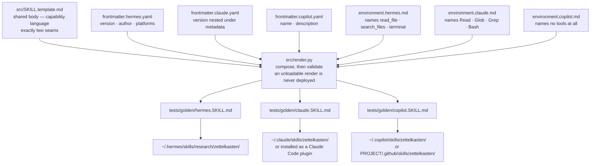
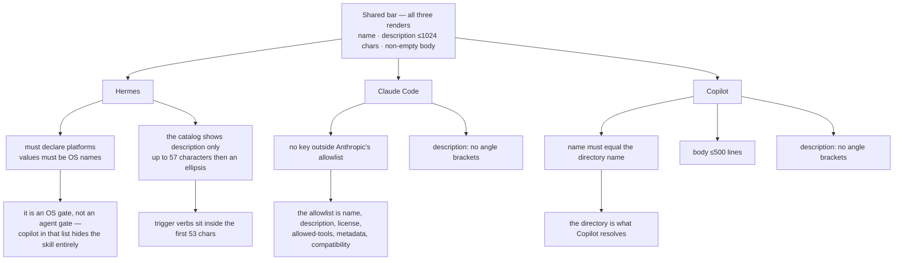
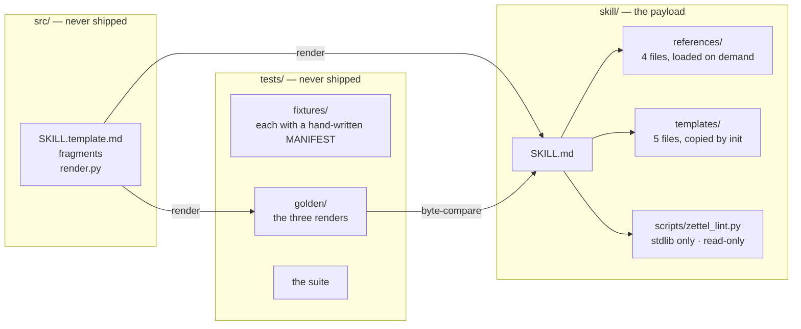
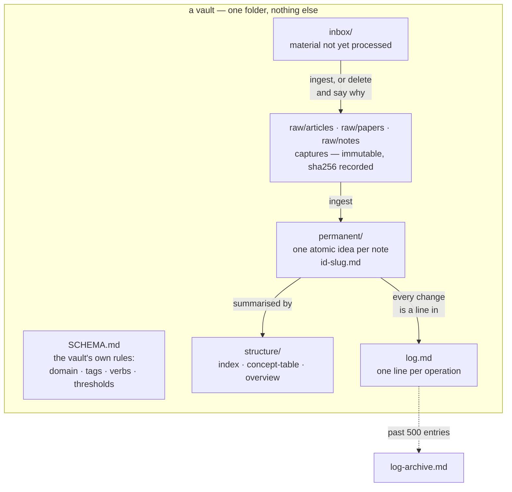
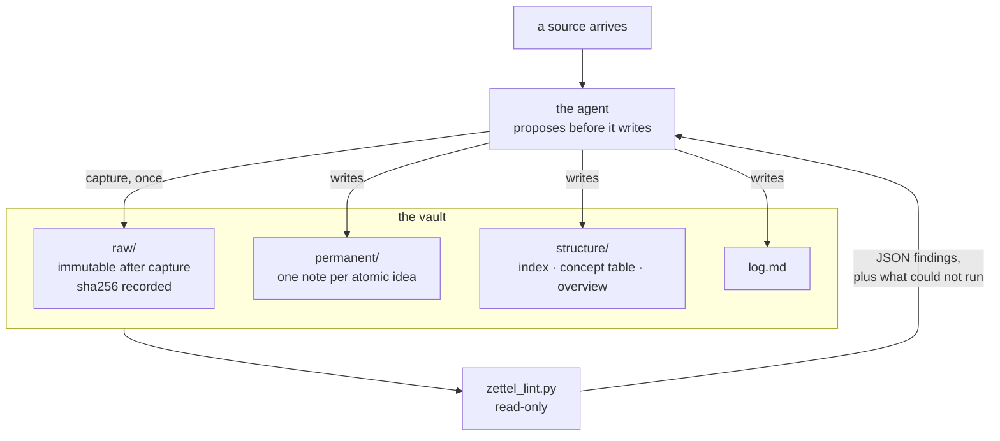

# Architecture

How this repo is shaped, and where the three platforms pull apart. The *reasons* — and the
platform code that was executed to find them — are in `design.md`; this file is the map.

## One body, three renders

The skill is written once in capability language and assembled three times. Nothing in the
shared body knows which platform it will run on.

The two seams are `{{FRONTMATTER}}` and `{{ENVIRONMENT}}`. An unfilled placeholder is a render
error rather than a truncated file, which is why the body can never ship half-assembled.

`tests/golden/` holds the three renders. They are the reviewable artifact *and* the oracle
`make check` diffs against, so the thing you read and the thing CI compares are the same bytes.

## Where the three contracts diverge

Every render must clear the same bar first: a `name` matching the kebab pattern and ≤64 chars, a
non-empty `description` ≤1024 chars, and a non-empty body. After that the rules are per-platform,
and each one exists because a platform's own code does something.

Three divergences are worth naming, because each is a silent failure rather than a loud one:

**The same version, written three ways.** Hermes takes `version:` at the top level. Claude's
allowlist has no `version` key at all, so it moves under `metadata:`. Copilot declares none.
Nothing validates that these agree — the tag, `plugin.json` and the Hermes fragment are three
separate declarations of one number.

**Hermes truncates the description to 57 characters.** That truncated string is the entire
discovery surface: a skill whose trigger verbs fall past it is present but unfindable. The
render is asserted to keep `ingest`, `query`, `lint`, `init` and `zettelkasten` inside the first
53.

**Copilot resolves the skill by directory name**, so `name:` must equal `zettelkasten`, and the
body is capped at 500 lines on third-party guidance. VS Code documents no limit; the cap is kept
because exceeding it is a real load failure in the wild.

## What ships, and what only looks like it ships

`install.sh` copies `SKILL.md`, `references/`, `templates/` and `scripts/` and nothing else. The
sources that produced them stay behind.

`skill/SKILL.md` exists because a plugin must ship a loadable `SKILL.md`, and a gitignored one
installs as zero skills. It is the Claude render, and `test_golden.py` asserts it byte-identical
to `tests/golden/claude.SKILL.md` — so the copy is for the loader, and the golden is still the
single source of truth. The guarantee moved from absence to a test.

## What a vault is

The artifact, before the loop that maintains it. `init` creates all of this in one folder, and
nothing else belongs in that folder: the vault root is the boundary of every write.

Three of those paths carry more weight than their contents: **`permanent/`, `SCHEMA.md` and `log.md`
are what make a folder a vault.** Resolution walks upward looking for all three together, and
`ZK001` names exactly these three when one is missing — a folder without them is reported as *not a
vault* and exits 2, rather than being linted as an empty vault and reported clean. That distinction
is the one the `not_a_vault` fixture exists to hold.

`log-archive.md` is the only path not there at the start. It appears when the log passes
`lint_log_rotation_entries`, because a log that only grows stops being readable and an unread log is
not a history. `SCHEMA.md` is the other file worth opening first: the linter carries a default for
every threshold, and a vault's own `SCHEMA.md` overrides them for that vault alone, which is how one
linter judges two vaults held to different standards.

## How it holds together at run time

The load-bearing separation: **the script verifies, the agent writes.** Nothing in `scripts/`
opens a file for writing, which is proven by a tree hash taken before and after a full lint run.

The loop is deliberately one-directional. The linter reads the vault and reports; it has no
`--fix` and no write path at all. A fix mode would be a second write path around ingest's
propose-then-approve contract, and the findings most worth acting on — which verb, one idea or
two — are the ones no script can decide.

Two properties of that loop are structural rather than conventional. `raw/` is never written
after capture, so hash drift is remedied by re-ingesting, never by editing the digest. And the
report carries `parse_failures[]` and `skipped_checks[]` as mandatory fields, so a check that
could not run says so instead of quietly becoming a clean result.
